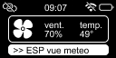
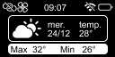
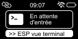

# ESP-01 Firmware
Neste repositório está todos os códigos, imagens e documentos do firmware desenvolvido para controlar um ```Display LED 128x64 I2C ``` e um ```Fan Cooler 12v``` ligado a um ```IRLZ44N``` por um ```ESP-01```.

O principal propósito é fazer com que um computador antigo ```Jumper-EZBOOK 3S, Intel Celeron N340, 6GB de RAM e 256GB SDD``` que será configurado como servidor por SSH com sistema **Linux <span style="color: green;">Mint</span>**  consiga mostrar status no Display bem como comandos rápidos.

## Protótipos das telas
   

## Arquivos/Classes importantes


| Nome | Arquivo | Descrição |
| :-----------| :----------- | :----------- |
|Display| Display.cpp / h| Implementa o controle do Display|
|WiFi| Server.cpp / h| Implementa a configuração do WiFi |
|Server| Server.cpp / h| Implementa o protocolo de recebimento de informação (TCP)|
